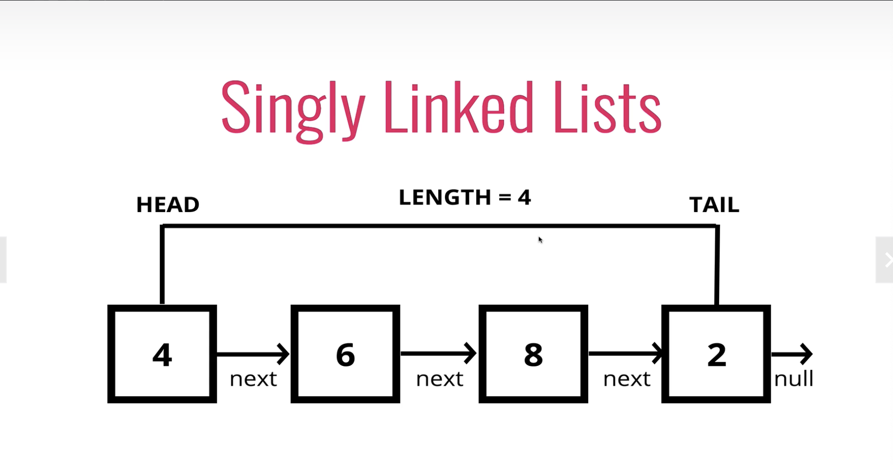

# single Linked list

> ## 배열과 차이점
### 배열

  * 각 요소가 인덱스를 가지고 정렬되어 있다.
  * 특정 인덱스에 바로 접근이 가능하다. 
  * 삽입과 삭제시 연결리스트에 비해 불리하다(인덱스를 재정렬해야하기 때문)
### single linked list
* 인덱스를 가지지 않는다.
* 다수의 노드는 next 포인터를 통해 서로 연결되어 있다.
* 랜덤 엑세스가 허용되지 않는다(x번째 노드를 찾기 위해선 첫번째부터 해당 노드까지 순서대로 따라가야 한다)
* 삽입과 삭제를 쉽게 할 수 있다.
  

>### single Linked list의 세가지 속성

1. head : 연결 리스트의 시작 노드를 가리킨다.
2. tail : 연결 리스트의 마지막 노드를 가리킨다. (중간의 노드는 일일히 추적하지 않는다.)
3. length : 연결 리스트의 길이를 나타낸다.

>### Big O 복잡도
* Insertion - O(1)
* Removal
* O(1) => 리스트 제일 앞의 노드를 제거하는 경우
* O(N) => 리스트 제일 마지막의 노드를 제거하는 경우
* Searching - O(N)
* Access - O(N)

삽입과 삭제 작업을 주로 하고, 임의 접근 작업이 필요없는 경우 단방향 연결 리스트가 적절한 자료구조이다.